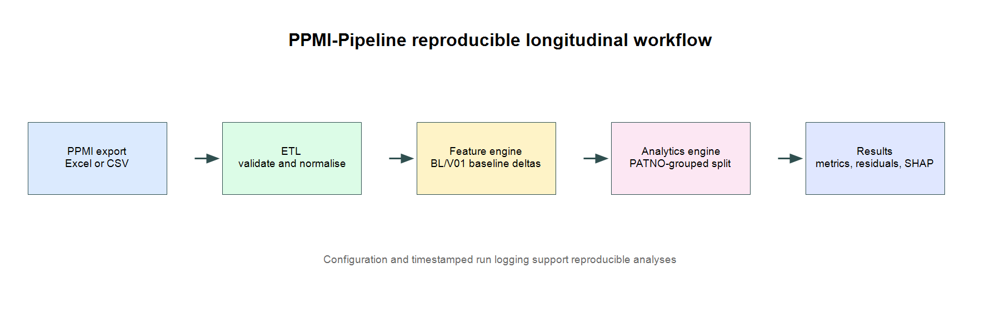

# Summary

Parkinson's disease research frequently relies on longitudinal clinical data: repeated assessments of the same participant describing cognition, motor function, symptoms, and treatment over time. Preparing these data for analysis is labour-intensive. Research must identify eligible visits, harmonise variable types, determine a participant-specific baseline, handle incomplete measurements, and avoid evaluating models on visits from participants already represented in the training data. These steps are often implemented as one-off scripts, making them difficult to inspect, reproduce, or reuse.

PPMI-Pipeline is a Python research workflow for automating these steps with curated exports from the Parkinson's Progression Markers Initiative (PPMI) [@ppmi_dataset]. The pipeline ingests a PPMI Excel or CSV export, validates its required clinical schema before loading the full file, normalises patient and visit identifiers, constructs longitudinal change-from-baseline outcomes, and evaluates models using patient-grouped train/test splits. Its single entry point, `main.py`, produces analyses for change in Montreal Cognitive Assessment (MoCA) score and MDS-UPDRS Part III motor score.

The workflow is configured through a version-controlled JSON file and produces timestamped artifacts for each run: a machine-readable metrics table, a plain-text run log containing the resolved input path and serialised configuration, residual-distribution figures, and SHAP feature-plots.

# Statement of Need

Longitudinal Parkinson's disease research requires analysis procedures that preserve the relationship between repeated visits and the participants from whom they were collected. In ad hoc notebook-based workflows, cohort selection, baseline definition, missing-data handling, and model evaluation are often implemented separately for each analysis. This makes the resulting protocol difficult to inspect and can introduce avoidable methodological errors. In particular, random row-level train/test splitting can place records from the same participants in both partitions, allowing participant-specific information to leak into evaluation and overstating expected performance on unseen participants.

General-purpose Python libraries provide reliable tools for tabular processing and machine learning but do not prescribe a PPMI-specific longitudinal analysis protocol [@mckinney2010; @pedregosa2011]. PPMI-Pipeline fills this applied gap by providing a configurable workflow that validates curated PPMI exports, identifies a participant-specific baseline (BL/V01), constructs MoCA and MDS-UPDRS Part III change-from-baseline outcomes, and evaluates models with `PATNO`-grouped splitting. The workflow makes the temporal reference, endpoint definition, predictors, and random seed explicit rather than leaving them dispersed across manual preprocessing steps.

The pipeline embeds median imputation within the training stage and automatically records timestamped metrics, configuration, input location, residual diagnostics, and SHAP feature-attribution plots. These outputs make each analysis easier to reproduce, audit, and communicate to collaborators and reviewers. The software is intended for clinical research and method development, not for diagnostic or treatment decisions.

# State of the Field

The PPMI study provides a large multi-modal resource for studying Parkinson's disease progression and biomarkers [@ppmi_dataset]. Its broad clinical and biological coverage enables a range of analyses, but it also makes reproducible longitudinal cohort preparation essential. General scientific Python libraries provide robust foundations for data management and machine learning, but they do not prescribe a PPMI-specific baseline definition, endpoint construction, patient-level split, or study-oriented result record.

PPMI-Pipeline occupies this applied layer. Rather than proposing a new disease model or replacing established libraries, it encodes a transparent clinical analysis protocol around them. The workflow gives researchers a defined starting point for two commonly used longitudinal clinical endpoints while retaining editable configuration for baseline event labels, predictors, model parameters, and input location. It therefore complements general data-science libraries by reducing repeated study-specific engineering.

# Software Design

The software is intentionally modular. Figure @fig:pipeline-architecture illustrates the pipeline's architecture, highlighting the flow from raw PPMI ingestion to final analytical outputs.

{#fig:pipeline-architecture}

`etl.py` implements PPMI input loading, header-only schema validation, type normalisation, and sorting by patient and visit date. Required columns include `PATNO`, `EVENT_ID`, `visit_date`, `moca`, and `updrs3_score`. Schema validation occurs before the full file is loaded so that incompatible exports produce a clear error message early in execution.

`feature_engine.py` transforms the patient-visit table into endpoint-specific modelling tables. For each participant, it selects the first valid configured baseline record and joins its values to later visits. Predictors include the endpoint's baseline value, baseline clinical covariates (age, sex, education, disease duration, and UPSIT score in the default configuration), and continuous days since baseline. The endpoint delta remains separate from these predictors, avoiding use of the later observed outcomes as an input feature.

`analytics_engine.py` creates a `RandomForestRegressor` inside a scikit-learn pipeline with median imputation. It uses `GroupShuffleSplit` on `PATNO` and reports mean absolute error (MAE), root mean squared error (RMSE), and the coefficient of determination ($R^2$) on held-out participants. The module saves residual histograms and TreeSHAP summary plots to support inspection of systematic prediction error and ranking of the clinical features that influence the fitted model [@lundberg2017].

`main.py` is the single execution entry point. It reads `config.json`, creates a timestamped run identifier, executes both configured endpoints, and writes a CSV metric table and text log. The log captures the timestamp, resolved input path, configuration, MAE, RMSE, and $R^2$ for each endpoint. A synthetic 50-participant fixture generator and unit tests are included so that the workflow can be exercised without access to controlled clinical data.

Two lightweight utilities in `utils/` support inspection of candidate PPMI exports by listing available columns before an analysis is run. Continuous integration is configured in `.github/workflows/ci.yml` and runs the unit-test suite on pushes and pull requests. Together with the synthetic fixture generator in `tests/`, this provides a repeatable check of schema validation and baseline-delta construction without requiring access to controlled clinical data.

# Research Impact

PPMI-Pipeline supports more reproducible clinical Parkinson's disease research by making cohort preparation and model-evaluation choices explicit and persistently recorded. The automated workflow reduces transcription and bookkeeping errors that can occur when data cleaning, feature construction, and result reporting are performed manually in notebooks or spreadsheets. It also makes it straightforward for collaborators and reviewers to identify the baseline definition, predictors, random seed, and patient-level split used to produce a given result.

The package is suited to exploratory progression modelling, sensitivity analyses, endpoint definitions or predictor sets, and training researchers in longitudinal machine-learning practice. The included SHAP outputs provide a clinically interpretable starting point for discussing which baseline features the model relies on most heavily. The software is not intended for diagnostic or treatment decisions, and results require appropriate clinical, statistical, and external validation before any translational use.

# AI Disclosure

The authors utilized OpenAI Codex during the development process to support code refactoring, generate unit test scaffolding, and perform static analysis to improve code quality and execution efficiency. The author reviewed, edited, and takes full responsibility for the final content, software design, analysis claims, and citations.

# Data Availability
This study acknowledges the Parkinson’s Progression Markers Initiative (PPMI) parent protocol. For detailed protocol information, please refer to the [PPMI website](https://www.ppmi-info.org).

This analysis used Tier 1 data from PPMI, consisting of clinical and patient-level CSV datasets. These data were downloaded on 2026-07-15 from the PPMI database (www.ppmi-info.org/access-data-specimens/download-data), RRID:SCR_006431.

# Acknowledgements

Data used in the preparation of this article was obtained on 2026-07-15 from the Parkinson's Progression Markers Initiative (PPMI) database (www.ppmi-info.org/access-data-specimens/download-data), RRID:SCR_006431. For up-to-date information on the study, visit www.ppmi-info.org.

PPMI—a public-private partnership—is funded by the Michael J. Fox Foundation for Parkinson's Research, and funding partners; including AbbVie, Alamar Biosciences, Aligning Science Across Parkinson’s (ASAP), Arrowhead Pharma, Arvinas, AskBio, BIAL, BioArctic, Biohaven, BlueRock Therapeutics, Bristol Myers Squibb, Calico Labs, Capsida Biotherapeutics, Critical Path Institute, DaCapo Brainscience, Denali, Edmond J. Safra Foundation, Eli Lilly, Gain Therapeutics, GE Healthcare, Genentech, GSK, Insitro, Johnson & Johnson Innovative Medicine, Lundbeck, Merck, Neumora, Neuron23, Novarti, Olink, Regeneron, Roche, Sanofi, Tenvie, UCB, Vanqua Bio, Voyager Therapeutics, The Weston Family Foundation.